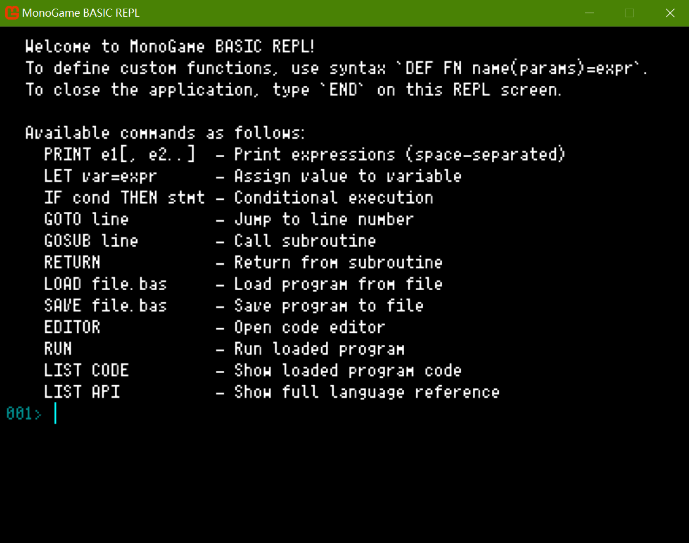
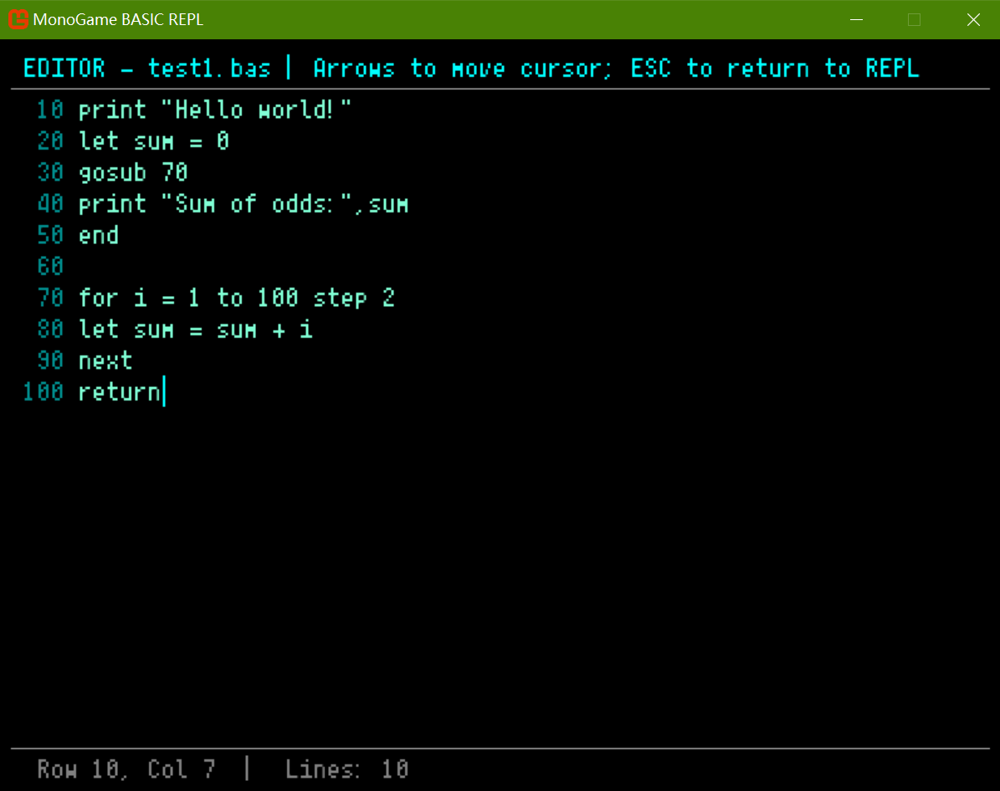

# MonoGame BASIC REPL (VB.NET)

A classic BASIC language interpreter built on top of MonoGame in VB.NET, featuring a simulated command-line interface (REPL) and a built-in code editor. The interpreter supports classic BASIC constructs like `PRINT`, `LET`, `IF...THEN`, `GOTO`/`GOSUB`, custom user functions via `DEF FN`, plus a library of built-in functions such as `SQR`, `SIN`, `COS`, `MID`, `IIF`, and more.

> **📌 Development Status**: The project is currently in maintenance mode. Active development is paused through late December - along with the related [HTML-BASIC](https://github.com/Pac-Dessert1436/HtmlBasic) project that has reached a functional plateau - while the author focuses on a critical academic commitment. _Bug reports and feature requests are welcome and will be triaged accordingly; all pending work will be resumed after that window._ See [Personal Notes](#personal-notes) for background.




## Description

This project is a personal take on the BASIC programming environments of the 1970s and 1980s — a read-eval-print loop (REPL) where you type commands and see results instantly, together with a simple text editor for writing multi-line programs, saving them to `.bas` files, and running them with `RUN`.

The project's codebase is organized using the **Model-View-Controller (MVC)** pattern:

- **Models** (`Models/`) — Represent the interpreter's runtime state (`ReplState`), tokens (`BasicToken`), and AST nodes (`AstNode`).
- **Controllers** (`Controllers/`) — The `Lexer`, `Parser`, and `Interpreter` turn raw text into tokens, then into an abstract syntax tree, and finally execute it.
- **Views** (`Views/`) — `ReplView` and `EditorView` render the terminal-style interface on top of MonoGame using a pixel font.

The application is written in **VB.NET** and targets **.NET 10** with **MonoGame 3.8.4**, so it should run on Windows, Linux, and macOS out of the box (via the DesktopGL platform). _The pixel font used for the application is [Fusion Pixel Font](https://github.com/TakWolf/fusion-pixel-font) by TakWolf, licensed under SIL Open Font License._

## Features

- **Interactive REPL** — type a BASIC statement and press `Enter` to execute it right away.
- **Built-in code editor** — type `EDITOR` at the REPL to open a multi-line text editor. Arrow keys move the cursor; `ESC` returns you to the REPL.
- **Programmable** — supports numbered lines, `RUN`, `LOAD`, `SAVE`, classic control flow with `GOTO`, `GOSUB`/`RETURN`, and counted loops with `FOR`/`NEXT`.
- **Variables & user functions** — use `LET` (or just `name = value`) and define reusable functions with `DEF FN name(params)=expr`.
- **Built-in math & string functions** — `ABS`, `SQR`, `SIN`, `COS`, `TAN`, `LOG`, `EXP`, `INT`, `RND`, `LEN`, `LEFT`, `RIGHT`, `MID`, `UCASE`, `LCASE`, `IIF`.
- **Operators** — full arithmetic (`+ - * /`, `MOD`), string concatenation (`&`), and comparison (`= < > <= >=`).
- **Comma-separated PRINT** — `PRINT "Hello", X, SQR(X)` prints multiple values on one line; bare `PRINT` prints a blank line.
- **One-line programs** — use `:` to put multiple statements on a single line: `FOR I = 1 TO 5 : PRINT I : NEXT I`.
- **Line-numbered programs** — files saved with `SAVE` are written in traditional numbered-line format and can be reloaded with `LOAD` (no need to type line numbers manually). 
- **Terminal-style UI** — rendered with a monospace pixel font inside a MonoGame window, with keyboard input and mouse-wheel scrolling.

## Requirements

- [.NET SDK 10](https://dotnet.microsoft.com/download/dotnet/10.0) or higher
- MonoGame 3.8.4 or higher (restored automatically via `dotnet restore`)
- IDE: Visual Studio 2026, Visual Studio Code, Rider, or any .NET-compatible editor

## Installation & Usage

1. Clone the repository:
   ```bash
   git clone https://github.com/Pac-Dessert1436/MonoGame-BASIC-REPL.git
   cd MonoGame-BASIC-REPL
   ```

2. Restore the project dependencies:
   ```bash
   dotnet restore
   ```

3. Build and run the application:
   ```bash
   dotnet build
   dotnet run
   ```

### Quick-start guide

Once the application opens you are at the REPL. Here are a few things to try:

```basic
PRINT 2 + 2
LET X = 10
PRINT X * X
PRINT "X =", X, "SQR(X) =", SQR(X)
PRINT

DEF FN SQUARE(N)=N*N
PRINT FN SQUARE(12)

FOR I = 1 TO 5 : PRINT I, I * I : NEXT I
IF X > 0 : PRINT "X is positive"

EDITOR
```

Inside the editor write a small program, press `ESC` to return to the REPL, then save and run it. For example:

```basic
10 PRINT "Counting from 1 to 10:"
20 FOR I = 1 TO 10
30   PRINT I
40 NEXT I
50 PRINT "Done!"
60 END
```

Or using a negative step for a countdown:

```basic
10 FOR N = 10 TO 1 STEP -1
20   PRINT N
30 NEXT N
```

Then from the REPL:

```basic
SAVE hello.bas
RUN
LOAD hello.bas
LIST CODE
```

For a full reference of supported language features, type `LIST API` inside the application.

## Known Limitations

- No `INPUT` statement — interactive input from the user during program execution is currently not supported, and implementing this feature will be time-consuming.
- The editor is intentionally minimal; it supports basic cursor movement and text editing but has no clipboard, search, or syntax highlighting.
- The `DIM` statement (for array declaration) and `REM` statement (for line comments) are not supported either. **Additional features and outstanding bug fixes are deferred until after December.**

## Personal Notes

I failed the Postgraduate Entrance Exam last year, which has been eating at me ever since - I keep replaying what went wrong, questioning what I could have done differently, and some days I feel genuinely desperate about whether I can pass this time around.

My mind hasn't been steady recently; I've been pouring energy into the programming world (including this little BASIC interpreter for MonoGame), partly as a distraction from all of that, and partly because coding is one of the few things that still makes me feel like I can actually finish something.

My study materials for this year's exam have already arrived, including those for TCM-related subjects. I completed most of the features in this app with the help of AI-assisted coding, and all those features are fully tested. **Now I have to put the keyboard down, take a break from GitHub, and just study - no more side projects, no more tinkering. Active development on this project is paused, and any hidden bugs will have to wait.**

This app is my attempt to build something small and concrete before I lock myself in a room with textbooks for the next five months. _**If this project's codebase feels rough or rushed in places - that's because it was. I was coding while trying not to think about what happens if I fail again.**_

```basic
10 PRINT "I'll try again."
20 PRINT "Wish me luck."
30 END
```

## License

This project is licensed under the BSD-3-Clause License. See the [LICENSE](LICENSE) file for details.